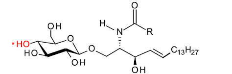
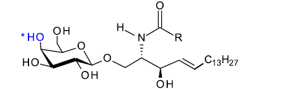

+++
lastmod = 2025-09-17T13:00:00Z
publishDate = 2025-09-12T10:00:00Z
title = "abbreviation"
+++

| Lipid Class                         | Abbr.   |
| ----------------------------------- | ------- |
| Cholesteryl ester                   | CE      |
| Ceramide                            | Cer     |
| Ceramide-1-phosphate                | CerP    |
| Cardiolipin                         | CL      |
| Diacylglycerol                      | DAG     |
|                                     | deoxySL |
| ether Lyso-Phosphatidic acid        | eLPA    |
| ether Lyso-Phosphatidylcholine      | eLPC    |
| ether Lyso-Phosphatidylethanolamine | eLPE    |
| ether Lyso-Phosphatidylinositol     | eLPI    |
| ether Lyso-Phosphatidylserine       | eLPS    |
| ether Phosphatidic acid             | ePA     |
| ether Phosphatidylcholine           | ePC     |
| ether Phosphatidylethanolamine      | ePE     |
| ether Phosphatidylglycerol          | ePG     |
| ether Phosphatidylinositol          | ePI     |
| ether Phosphatidylserine            | ePS     |
|                                     | GB4     |
|                                     | GD3     |
|                                     | GM1     |
|                                     | GM3     |
|                                     | GM4     |
| Dihexosylceramides                  | Hex2Cer |
| Trihexosylceramide                  | Hex3Cer |
| Hexosylceramide                     | HexCer  |
| Lyso-Phosphatidic acid              | LPA     |
| Lyso-Phosphatidylcholine            | LPC     |
| Lyso-Phosphatidylethanolamine       | LPE     |
| Lyso-Phosphatidylinositol           | LPI     |
| Lyso-Phosphatidylserine             | LPS     |
| Phosphatidic acid                   | PA      |
| Phosphatidylcholine                 | PC      |
| Phosphatidylethanolamine            | PE      |
| Phosphatidylglycerol                | PG      |
| Phosphatidylinositol                | PI      |
| Phosphatidylserine                  | PS      |
| Sphingomyelin                       | SM      |
| Triacylglycerol                     | TAG     |

Hexosylceramide (HexCer) could be Glucosylceramides (GlcCer) or Galactosylceramides (GalCer)  
  
  
Dihexosylceramides (Hex2Cer) could be Lactosylceramides (LacCer) or ???  
