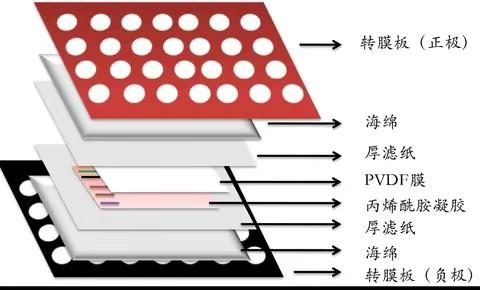

+++
lastmod = 2025-09-17T13:00:00Z
publishDate = 2025-09-12T10:00:00Z
title = "Western Blot"
+++

## Protocol

### SDS-PAGE

ref:  
~15kDa, 15%PAGE胶, 90V 20min and then 150V 50min  

### 转膜

Wet

裁膜  
8.5 x 6.5 cm  

ref:  
~15kDa, 350mA, 60min  

### 封闭和孵育抗体

PBST: PBS/Tween20, 1000:1, v/v

1. 封闭
   1. 5% BSA溶液封闭1小时, 用PBST配制
2. PBST洗涤3次, 每次5分钟
3. 一抗
   1. 1:1000孵育2小时或4°C过夜, 用一抗稀释液配制, 可回收使用
4. PBST洗涤3次, 每次5分钟
5. 二抗
   1. 1:5000-1:2000孵育1小时或4°C过夜, 用封闭液配制
6. PBST洗涤3次, 每次5分钟

### imaging
