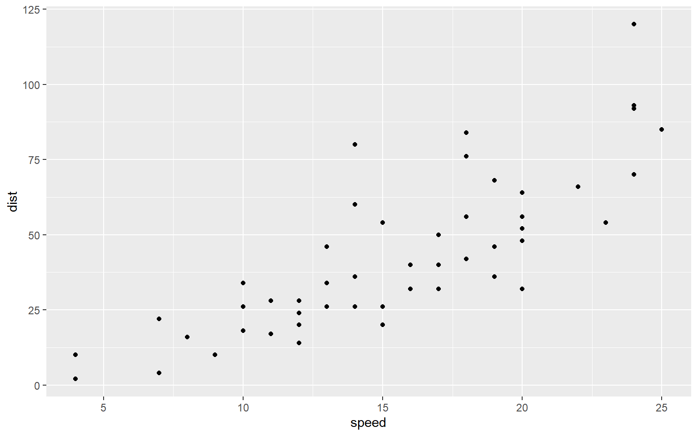
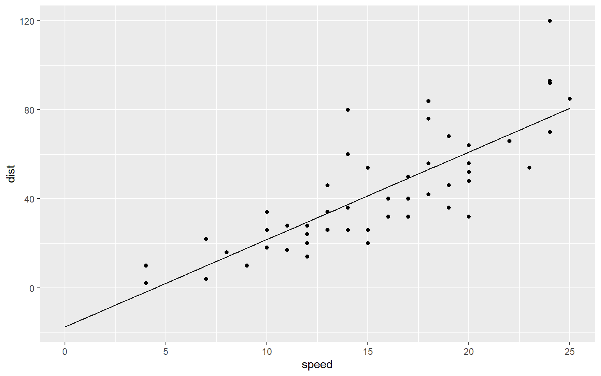

ref: [\[label\](https://rpubs.com/russH/378543)](https://rpubs.com/russH/378543)

<details class="code-fold">
<summary>Code</summary>

``` r
library(magrittr)
library(ggplot2)
```

</details>

## dataset

<details class="code-fold">
<summary>Code</summary>

``` r
head(cars)
```

</details>

      speed dist
    1     4    2
    2     4   10
    3     7    4
    4     7   22
    5     8   16
    6     9   10

<details class="code-fold">
<summary>Code</summary>

``` r
ggplot(cars, aes(x = speed, y = dist)) +
  geom_point()
```

</details>



## linear model

<details class="code-fold">
<summary>Code</summary>

``` r
# set fit model
linear_model <- lm(dist ~ speed, data = cars)
```

</details>
<details class="code-fold">
<summary>Code</summary>

``` r
# view the summary
summary(linear_model)
```

</details>


    Call:
    lm(formula = dist ~ speed, data = cars)

    Residuals:
        Min      1Q  Median      3Q     Max 
    -29.069  -9.525  -2.272   9.215  43.201 

    Coefficients:
                Estimate Std. Error t value Pr(>|t|)    
    (Intercept) -17.5791     6.7584  -2.601   0.0123 *  
    speed         3.9324     0.4155   9.464 1.49e-12 ***
    ---
    Signif. codes:  0 '***' 0.001 '**' 0.01 '*' 0.05 '.' 0.1 ' ' 1

    Residual standard error: 15.38 on 48 degrees of freedom
    Multiple R-squared:  0.6511,    Adjusted R-squared:  0.6438 
    F-statistic: 89.57 on 1 and 48 DF,  p-value: 1.49e-12

<details class="code-fold">
<summary>Code</summary>

``` r
# predict distance
predict(linear_model)
```

</details>

            1         2         3         4         5         6         7         8 
    -1.849460 -1.849460  9.947766  9.947766 13.880175 17.812584 21.744993 21.744993 
            9        10        11        12        13        14        15        16 
    21.744993 25.677401 25.677401 29.609810 29.609810 29.609810 29.609810 33.542219 
           17        18        19        20        21        22        23        24 
    33.542219 33.542219 33.542219 37.474628 37.474628 37.474628 37.474628 41.407036 
           25        26        27        28        29        30        31        32 
    41.407036 41.407036 45.339445 45.339445 49.271854 49.271854 49.271854 53.204263 
           33        34        35        36        37        38        39        40 
    53.204263 53.204263 53.204263 57.136672 57.136672 57.136672 61.069080 61.069080 
           41        42        43        44        45        46        47        48 
    61.069080 61.069080 61.069080 68.933898 72.866307 76.798715 76.798715 76.798715 
           49        50 
    76.798715 80.731124 

<details class="code-fold">
<summary>Code</summary>

``` r
# create a smooth line
additional_data <- data.frame(
  # This gives a sequence of 100 evenly spaced values between 0 and 25
  speed = seq(0, 25, length.out = 100)
)

linear_smooth <- predict(linear_model, newdata = additional_data)

linear_fitted_data <- data.frame(
  additional_data,
  dist = linear_smooth
)

ggplot(cars, aes(x = speed, y = dist)) +
  geom_point() +
  geom_line(data = linear_fitted_data)
```

</details>


