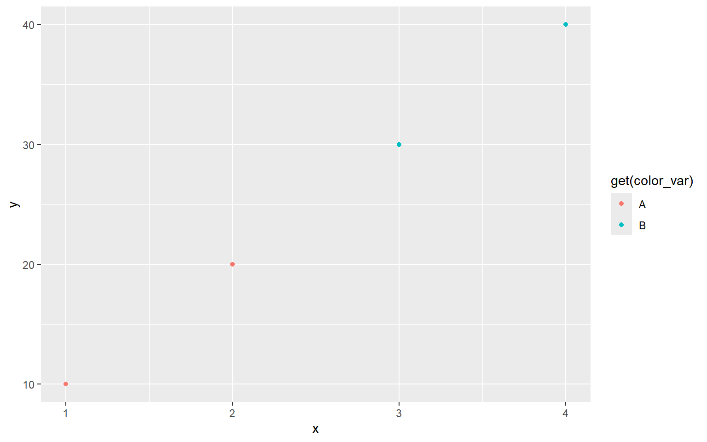
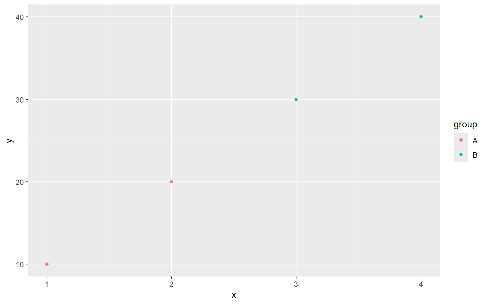

## 开头定义变量

<details class="code-fold">
<summary>Code</summary>

``` r
library(ggplot2)

# 创建一个包含变量的数据框
data <- data.frame(
  x = c(1, 2, 3, 4),
  y = c(10, 20, 30, 40),
  group = c("A", "A", "B", "B")
)

# 定义一个变量，用于替换图形属性
color_var <- "group"

# 使用变量替换创建散点图
ggplot(data, aes(x = x, y = y, color = !!as.name(color_var))) +
  geom_point()
```

</details>


<details class="code-fold">
<summary>Code</summary>

``` r
ggplot(data, aes(x = x, y = y, color = get(color_var))) +
  geom_point()
```

</details>



<details class="code-fold">
<summary>Code</summary>

``` r
ggplot(data, aes(x = x, y = y, color = !!sym(color_var))) +
  geom_point()
```

</details>


<details class="code-fold">
<summary>Code</summary>

``` r
ggplot(data, aes(x = x, y = y, color = .data[[color_var]])) +
  geom_point()
```

</details>


