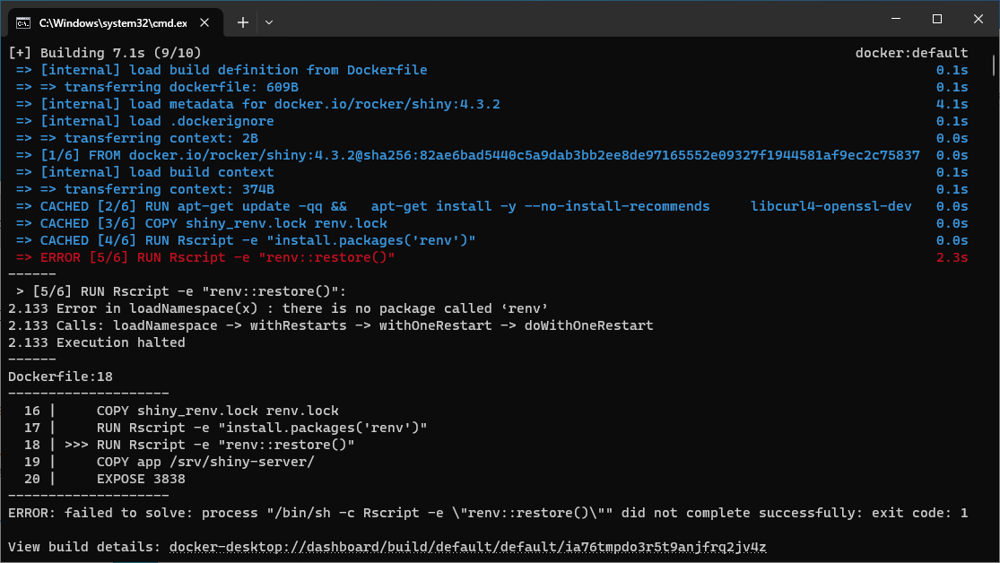

+++
lastmod = 2025-09-17T13:00:00Z
publishDate = 2025-09-12T10:00:00Z
title = "shinyproxy"
+++

## 自动生成shiny的Dockerfile

https://www.jumpingrivers.com/blog/shiny-auto-docker/

functions
```
glue_sys_reqs = function(pkgs) {
  rlang::check_installed("curl")
  rspm = Sys.getenv("RSPM_ROOT", "https://packagemanager.rstudio.com")
  rspm_repo_id = Sys.getenv("RSPM_REPO_ID", 1)
  rspm_repo_url = glue::glue("{rspm}/__api__/repos/{rspm_repo_id}")
  
  pkgnames = glue::glue_collapse(unique(pkgs), sep = "&pkgname=")
  
  req_url = glue::glue(
    "{rspm_repo_url}/sysreqs?all=false",
    "&pkgname={pkgnames}&distribution=ubuntu&release=22.04"
  )
  res = curl::curl_fetch_memory(req_url)
  sys_reqs = jsonlite::fromJSON(rawToChar(res$content), simplifyVector = FALSE)
  if (!is.null(sys_reqs$error)) rlang::abort(sys_reqs$error)

  sys_reqs = purrr::map(sys_reqs$requirements, purrr::pluck, "requirements", "packages")
  sys_reqs = sort(unique(unlist(sys_reqs)))
  sys_reqs = glue::glue_collapse(sys_reqs, sep = " \\\n    ")
  glue::glue(
    "RUN apt-get update -qq && \\ \n",
    "  apt-get install -y --no-install-recommends \\\n    ",
    sys_reqs,
    "\ && \\\n",
    "  apt-get clean && \\ \n",
    "  rm -rf /var/lib/apt/lists/*",
    .trim = FALSE
  )
}

shiny_write_docker = function(
  path = ".", appdir = "app", lockfile = "shiny_renv.lock",
  port = 3838, expose = TRUE, rspm = TRUE
) {
  rspm_env = ifelse(
    rspm,
    "ENV RENV_CONFIG_REPOS_OVERRIDE https://packagemanager.rstudio.com/cran/latest\n",
    ""
  )
  from_shiny_version = glue::glue("FROM rocker/shiny:{getRversion()}")
  renv::snapshot(
    project = path,
    lockfile = lockfile,
    prompt = FALSE,
    force = TRUE
  )
  pkgs = renv::dependencies(appdir)$Package
  sys_reqs = glue_sys_reqs(pkgs)
  copy_renv = glue::glue("COPY {lockfile} renv.lock")
  renv_install = 'RUN Rscript -e "install.packages(\'renv\')"'
  renv_restore  = 'RUN Rscript -e "renv::restore()"'
  
  copy_app = glue::glue("COPY {appdir} /srv/shiny-server/")
  expose = ifelse(expose, glue::glue("EXPOSE {port}"), "")
  cmd = 'CMD ["/usr/bin/shiny-server"]'
  
  ret = purrr::compact(list(
    from_shiny_version,
    rspm_env,
    sys_reqs,
    copy_renv,
    renv_install,
    renv_restore,
    copy_app,
    expose,
    cmd
  ))
  readr::write_lines(ret, file = file.path(path, "Dockerfile"))
}
```

auto-generate dockerfile file
```
shiny_write_docker(path = ".", appdir = "app")
```

build docker image
```
docker build -t your_image_name .
```

test
```
docker run --rm -p 3838:3838 your_image_name
```

docker build issues

```
docker build --no-cache -t your_image_name .
```