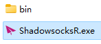
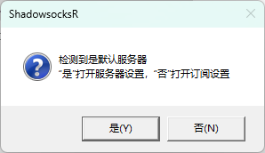
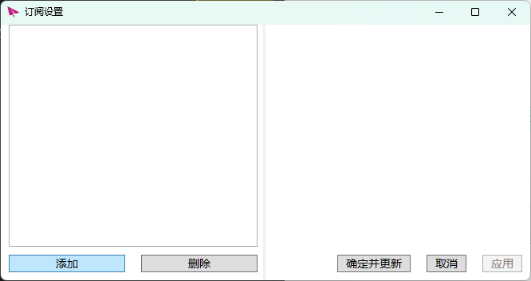
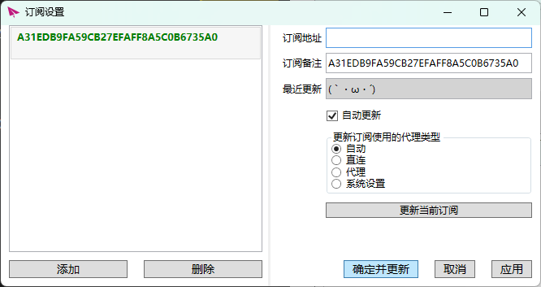
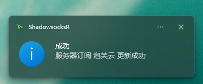
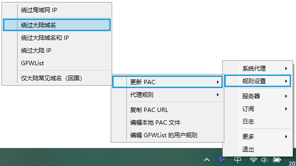
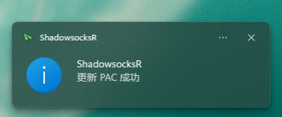
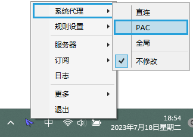
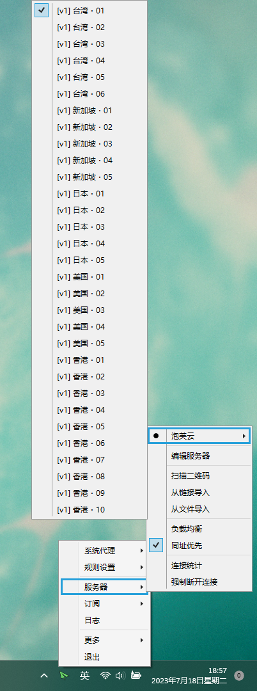

+++
lastmod = 2025-09-17T13:00:00Z
publishDate = 2025-09-12T10:00:00Z
title = "SSR"
+++

个人认为ssr是最好用的梯子，免安装，轻量，小飞机图标好看，开机自启，PAC规则满足需求，无需自己配置，第一天安装完配置好，以后都不用管了

ShadowsockR[点此直接下载win64版本](https://github.com/HMBSbige/ShadowsocksR-Windows/releases/download/6.1.0/ShadowsocksR-Win64-6.1.0.7z)

1. **解压缩后双击打开**

2. **否**

3. **添加**

4. **订阅地址填你购买的，点击确定并更新**

5. **订阅更新成功**

6. **更新PAC，选择绕过大陆域名**

7. **PAC更新成功**

8. **代理方式选择PAC**

9. **更换节点，新加坡和日本可以访问chatGPT**

