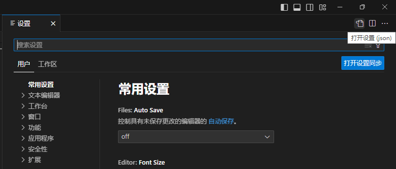

+++
lastmod = 2025-09-17T20:00:00
publishDate = 2025-09-12T18:00:00
title = "VSCode"
+++

Visual Studio Code是

## 安装VSCode

前往[https://code.visualstudio.com](https://code.visualstudio.com)下载安装包
均默认安装

## VSCode设置

`Ctrl+,`打开设置  
  
点击右上角，会打开这个文件  
  
任何不同于默认设置的设置都会显示在这里，是用code表示设置的一种方式，和图形界面中的设置是一致的，只是表现方式不同  
关于全局我只设置了一个，在所有文件中显示空格  

```
"editor.renderWhitespace": "all"
```

## 在VSCode中使用Markdown

### Markdown语法

Markdown是

|Type| Get|
|- |-|
|# 一级标题|
|## 二级标题|
|### 三级标题|
|#### 四级标题|
|##### 五级标题|
|###### 六级标题|
|\*Italic\*|*Italic*|
|\*\*Bold\*\*|**Bold**|
|- list1\<br\>- list2


### 安装插件

#### 必要

`Markdown All in One`

`Ctrl+K Ctrl+S`打开键盘快捷方式，点击右上角编辑`keybindings.json`  
实验记录中的单位

```
{
    "key": "alt+u",
    "command": "type",
    "when": "editorTextFocus && editorLangId == markdown",
    "args": { "text": "μ" }
},
{
    "key": "alt+c",
    "command": "type",
    "when": "editorTextFocus && editorLangId == markdown",
    "args": { "text": "°C" }
}
```

上标下标
```
{
        "key": "alt+up",
        "command": "editor.action.insertSnippet",
        "when": "editorTextFocus && editorLangId == markdown",
        "args": {
            "snippet": "<sup>${TM_SELECTED_TEXT}$0</sup>"
        }
    },
    {
        "key": "alt+down",
        "command": "editor.action.insertSnippet",
        "when": "editorTextFocus && editorLangId == markdown",
        "args": {
            "snippet": "<sub>${TM_SELECTED_TEXT}$0</sub>"
        }
    }
```

**内置的快捷键**  
`Ctrl+B`**文本加粗**  
`Ctrl+I`*文本斜体*  

#### 次必要

`markdownlint`检查语法  
`Markdown Preview Enhanced`渲染效果实时预览  

#### 非必要，但很高效

`Paste Image`快速从剪贴板粘贴图片到md  

`Paste Image`用`Ctrl+alt+v`粘贴图片  
可以打开`settings.json`添加以下自定义设置  

```
"pasteImage.showFilePathConfirmInputBox": true,  // 粘贴命令后显示文件路径确认窗口
"pasteImage.filePathConfirmInputBoxMode": "onlyName",  // 确认窗口只显示文件名
"pasteImage.path": "${currentFileDir}/${currentFileNameWithoutExt}_img",  // 图片粘贴到当前md文件的目录下的文件夹filename_img中, filename为当前md文件的名字
"pasteImage.insertPattern": ""  // 插入md文件的格式
```

更多自定义设置可以参考[https://github.com/mushanshitiancai/vscode-paste-image](https://github.com/mushanshitiancai/vscode-paste-image)

#### 非必要

`Markmap`生成思维导图

## 在VSCode中使用R

### 配置R环境以及终端radian

#### 不使用Anaconda

##### 安装R

[https://cran.r-project.org](https://cran.r-project.org)
-> Download R for Windows
-> base
-> Download R-4.x.x for Windows
安装到C盘或D盘都可以

- R包安装位置的管理

你现在可以在R中用`.libPaths()`查看R包安装位置  
通常是这两个位置`C:/` `<path of R>/lib`  
不论R语言安装到C盘或D盘  
默认情况下若未指定R包安装位置，首先都会安装到  
需要手动进行修改  
`win+R`输入`%userprofile%`  
再进入文档，新建txt，输入以下内容，`install.packages("xx")`若不指定位置，以后都会默认安装到第一条路径  

```
.libPaths(c(
    "C:/Users/xxxx/AppData/Local/R/win-library/4.2",
    "C:/Program Files/R/R-4.3.1/library",
    "C:\\Users\\xxxx\\Documents\\R\\win-library\\4.2"
))
```

追加一句，这是为了防止VSCode中使用radian出现中文乱码

```
Sys.setenv(LANG = 'en_US.UTF-8')
```

最后将txt重命名为`.Rprofile`

##### 安装radian

不安装也能在VSCode中用R了，但是没有语法高亮和自动补全，即原生的R，很难用
VSCode+R+radian就相当于RStudio  

radian安装依赖于python，需要先安装python  
python下载安装[https://www.python.org/downloads](https://www.python.org/downloads)  
安装的时候记得勾选添加到环境变量中  
`win+R`输入`cmd`，直接运行  

```
pip install -U radian
```

##### settings.json必要的配置

`Ctrl+,`打开设置，点击右上角编辑`settings.json`

```
"editor.renderWhitespace": "all",
"r.bracketedPaste": true,
"r.plot.useHttpgd": true,
"r.rpath.windows": "D:\\Program Files\\R\\R-4.3.2\\bin\\R.exe",
"r.rterm.windows": "D:\\Program Files\\Python\\Python311\\Scripts\\radian.exe",
"r.rterm.option": [
    "--no-site-file"
],
"r.session.levelOfObjectDetail": "Detailed",
```

#### 配合Anaconda管理环境

##### 安装Anaconda

前往[https://www.anaconda.com/download](https://www.anaconda.com/download)下载安装包
均默认安装
以下内容以安装在`D:\Anaconda3`作为演示

- 如果你的电脑已经安装python
不要将Anaconda添加到环境变量中，会发生冲突

- 如果你的电脑没有安装python
将Anaconda添加到环境变量中
`win+R`输入`sysdm.cpl`
-> 高级
-> 环境变量
-> 选中系统变量下的Path
-> 编辑
双击下方空白处，添加以下四行

```
D:\Anaconda3\
D:\Anaconda3\Scripts
D:\Anaconda3\Library\bin
D:\Anaconda3\Library\mingw-w64\bin
```

##### 新建虚拟环境安装R和radian

ref: https://blog.csdn.net/Y1575071736/article/details/120692120
`开始菜单`->`Anaconda3`->`Anaconda Prompt`

创建名为`r_env`的虚拟环境

```
conda create --name r_env python python=3.8
```

安装R和radian (截止到2023年7月, conda R win-64 只更新到4.1.3, 这里可以查看[https://anaconda.org/conda-forge/r-base](https://anaconda.org/conda-forge/r-base)，虽然不是最新的，但也没有问题)
```
conda install -c conda-forge r-base r-base=4.1.3
pip install -U radian
conda install -c conda-forge r-languageserver
```

再将其添加到环境变量中  
`win+R`输入`sysdm.cpl`  
-> 高级  
-> 环境变量  
-> 选中系统变量下的Path  
-> 编辑  
双击下方空白处，添加以下四行  
```
D:\Anaconda3\envs\r_env
D:\Anaconda3\envs\r_env\Scripts
D:\Anaconda3\envs\r_env\Library\bin
D:\Anaconda3\envs\r_env\Library\mingw-w64\bin
```

##### settings.json必要的配置

`Ctrl+,`打开设置，点击右上角编辑`settings.json`

```
"r.bracketedPaste": true,
"r.plot.useHttpgd": true,
"r.rpath.windows": "D:\\Anaconda3\\envs\\r_env\\Scripts\\R.exe",
"r.rterm.windows": "D:\\Anaconda3\\envs\\r_env\\Scripts\\radian.exe"
"r.rterm.option": [
    "--no-site-file",
    "--r-binary=D:\\Anaconda3\\envs\\r_env\\Scripts\\R.exe"
]
```

### 赋值和管道符快捷键

`Ctrl+K Ctrl+S`打开键盘快捷方式，点击右上角编辑`keybindings.json`

```
// keybindings for R scripts
{
    "key": "alt+-",
    "command": "type",
    "args": { "text": " <- " },
    "when": "editorTextFocus && editorLangId == r"
},
{
    "key": "ctrl+shift+m",
    "command": "type",
    "args": { "text": " %>% " },
    "when": "editorTextFocus && editorLangId == r"
},
// keybindings for Rmarkdown
{
    "key": "alt+-",
    "command": "type",
    "args": { "text": " <- " },
    "when": "editorTextFocus && editorLangId == rmd"
},
{
    "key": "ctrl+shift+m",
    "command": "type",
    "args": { "text": " %>% " },
    "when": "editorTextFocus && editorLangId == rmd"
},
// keybindings for all terminals
{
    "key": "alt+-",
    "command": "workbench.action.terminal.sendSequence",
    "args": { "text": " <- " },
    "when": "terminalFocus"
},
{
    "key": "ctrl+shift+m",
    "command": "workbench.action.terminal.sendSequence",
    "args": { "text": " %>% " },
    "when": "terminalFocus"
}
```

## 快速启动工作区

建立.bat  
内容为  
code "path of folder" | exit  


## reference

Windows 10 + Anaconda + r-base +Radian（terminated with exit code: 1）R 环境配置终极解决方案
[https://blog.csdn.net/Y1575071736/article/details/120692120](https://blog.csdn.net/Y1575071736/article/details/120692120)