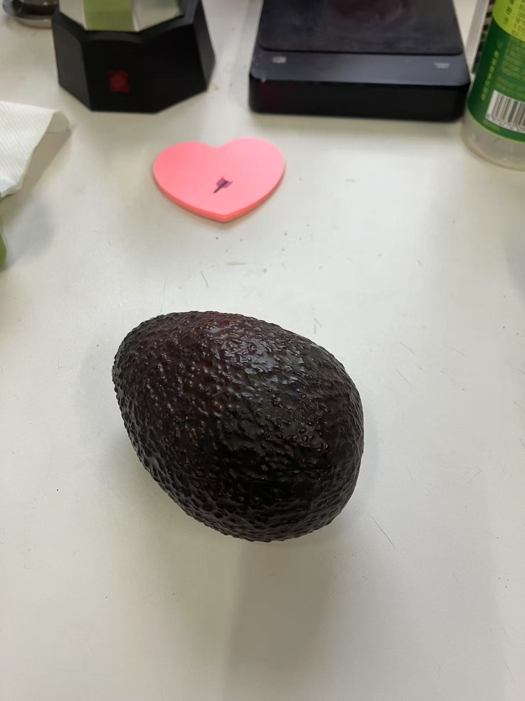
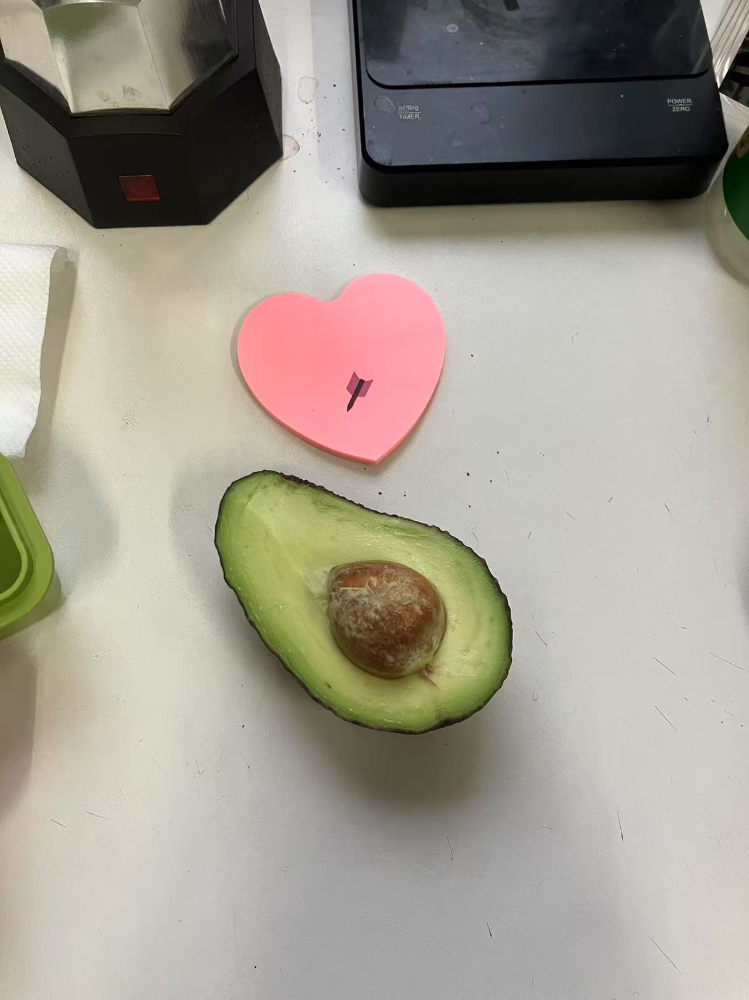
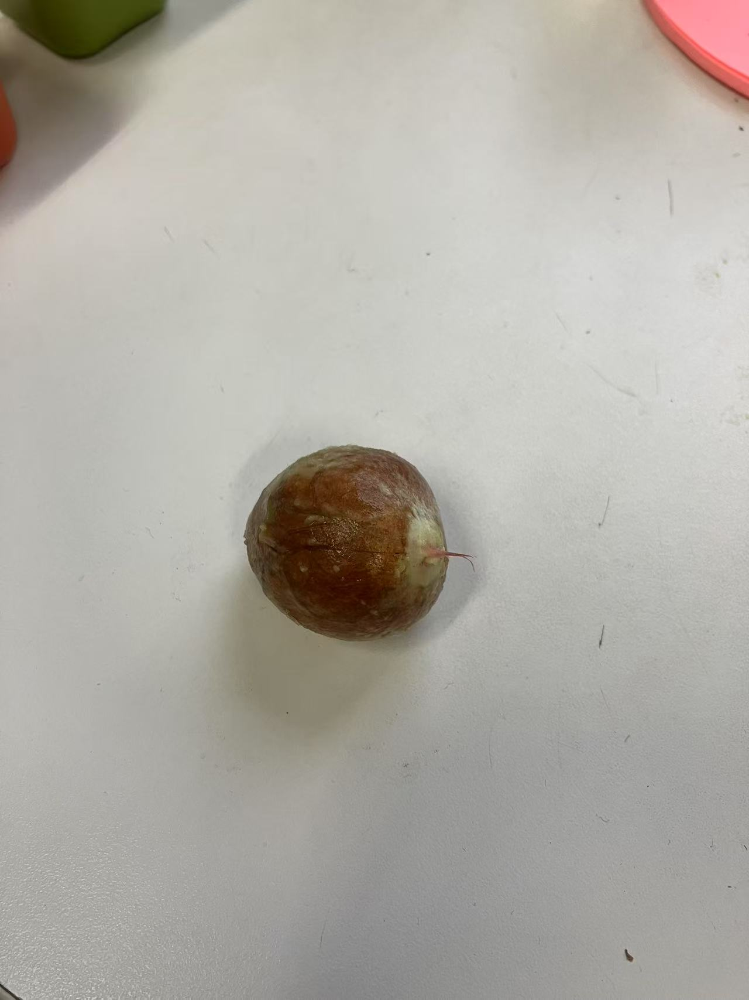
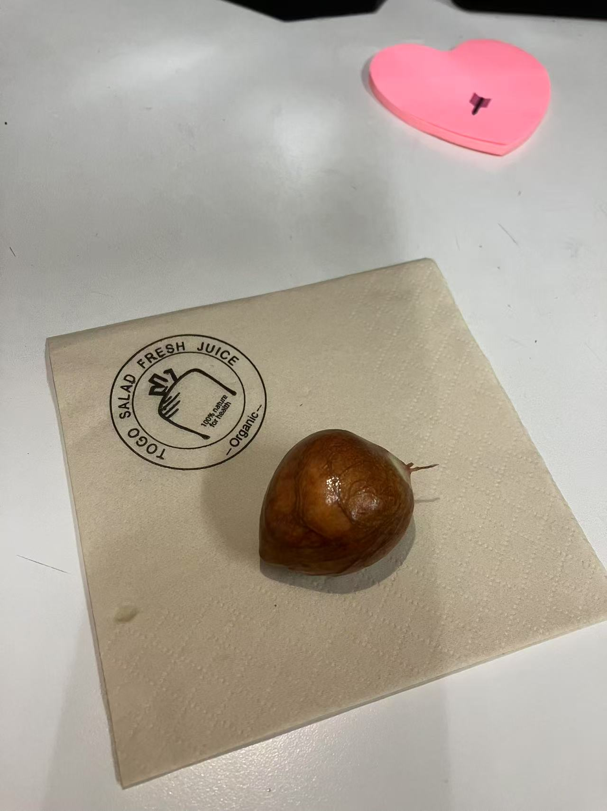
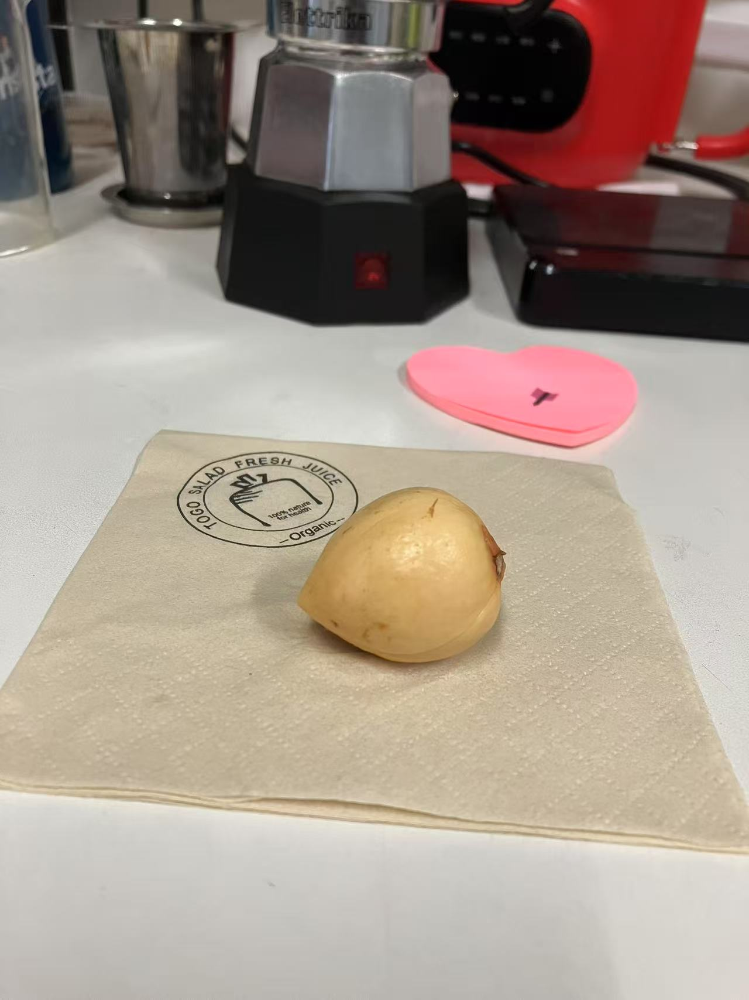
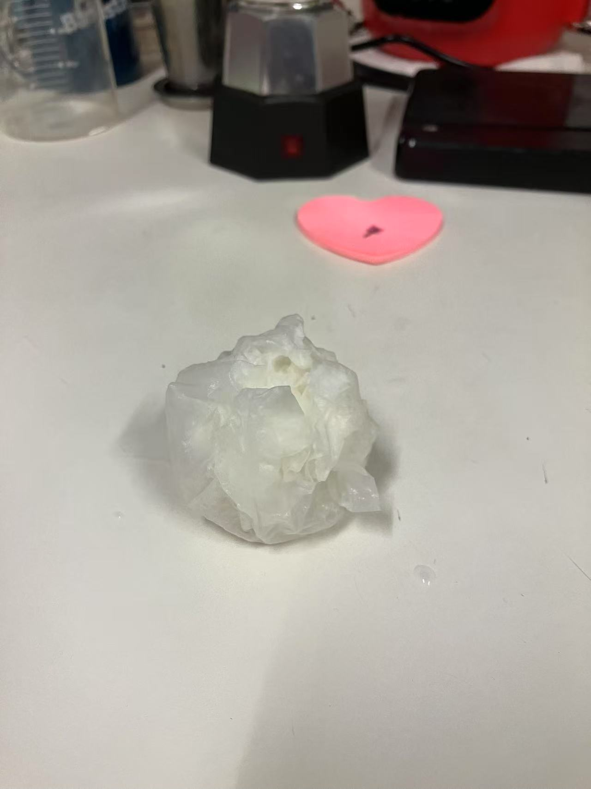
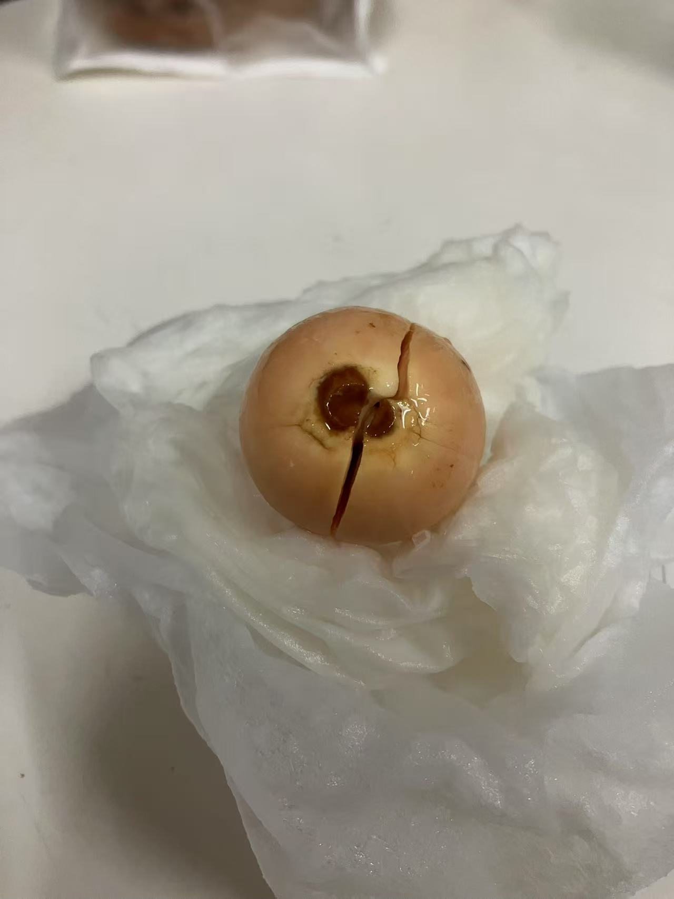
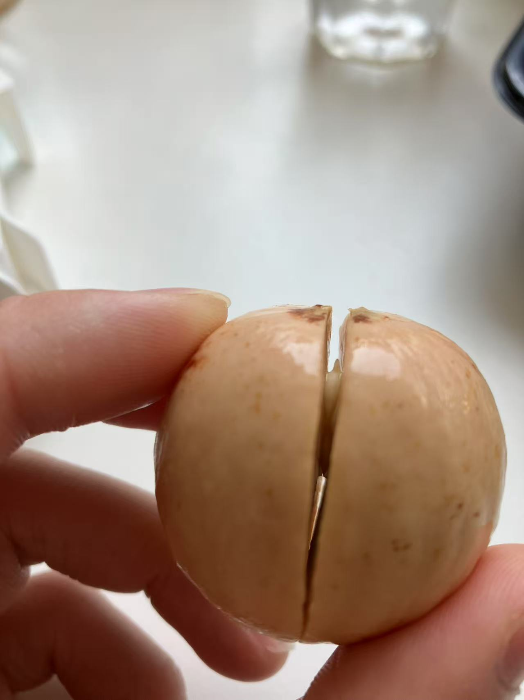
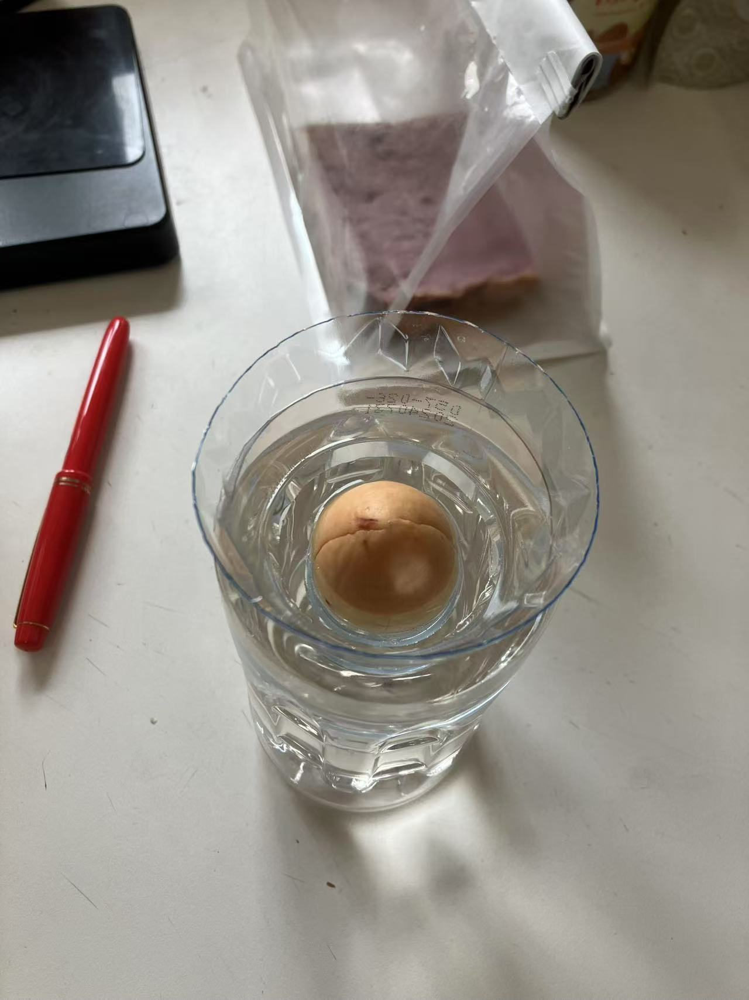

+++
title = "牛油果计划"
description = "从果实到树, 记录/指南"
[params]
  featured = "images/overview01.jpg"
+++

  
一颗成熟的牛油果  

  
一颗正在被吃的牛油果  

  
一颗吃剩的牛油果  

  
把果核清洗干净  

  
把果核外面的皮撕掉  

  
把果核用润湿的餐巾纸包裹起来  

  
？天后，果核会自己裂开  

  
侧面可以看到它的根  

  
放置在自制的水培瓶口，水没过根  

根可以是1或2或3

展开4/5个叶片, 并且高度在12cm以上时可以转成土培

土是拼多多买的

放在室内窗边即可

刚入土浇的勤一点

后面可以14天一浇

如果长菌的话可以用小粉

